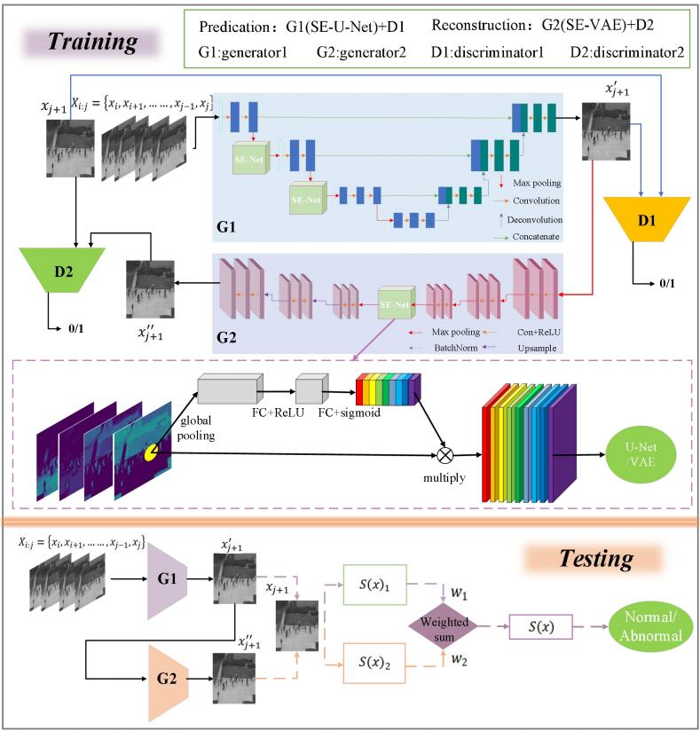

# Dual_Group-GAN
Dual GroupGAN: An unsupervised Four-Competitor (2V2) approach for video anomaly detection.

### The network pipeline.  


## Environments  
PyTorch 1.12.1.  
Python 3.7.16.  
tensorboardX  
cupy  
sklearn  
Other common packages.  

## Prepare
- Download the ped2 and avenue datasets.  
- Modify 'data_root' in `config.py`, and then unzip the datasets under your data root.

## Train
```Shell
# Train by default with specified dataset.
python trainGGDD.py --dataset=avenue
# Train with different batch_size, you might need to tune the learning rate by yourself.
python trainGGDD.py --dataset=avenue --batch_size=16
# Set the max training iterations.
python trainGGDD.py --dataset=avenue --iters=80000
# Set the save interval and the validation interval.
python trainGGDD.py --dataset=avenue --save_interval=2000 --val_interval=2000
# Resume training with the latest trained model or a specified model.
python trainGGDD.py --dataset=avenue --resume latest [or avenue_10000.pth]
# Train with Flownet2SD instead of lite-flownet.
python trainGGDD.py --dataset=avenue --flownet=2sd
# Visualize the optic flow during training.
python trainGGDD.py --dataset=avenue --show_flow
```

## Evalution
```Shell
# Validate with a trained model.
python evaluate.py --dataset=ped2 --trained_model=ped2_26000.pth
# Show and save the psnr curve and the difference heatmap between the gt frame and the 
# generated frame during evaluating. This drops fps.
python evaluate.py --dataset=ped2 --trained_model=ped2_26000.pth --show_curve --show_heatmap
```
